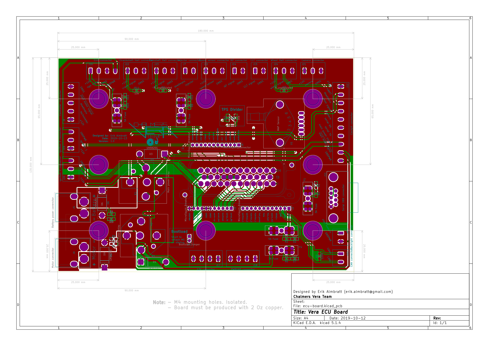
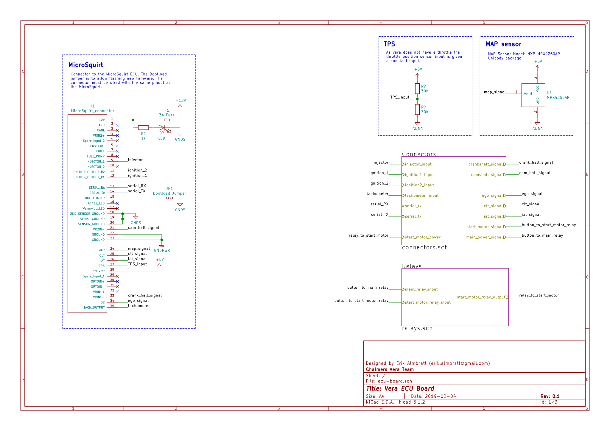
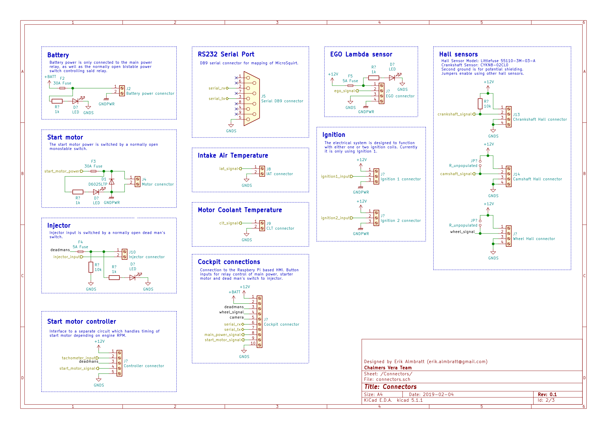

# Vera-ECU-Board
A PCB to break out connections to a MicroSquirt Engine Control Unit. Meant to be implemented for the Vera car of Chalmers Vera Team.
PCBWay sponsored the PCB and you can read about it [here!](http://chalmersverateam.se/wp-content/uploads/2019/12/PCBWAY_2019.pdf) 

